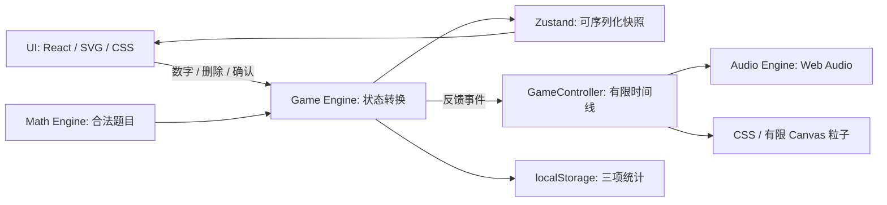

# Cici 小博士 · MVP 架构

Phase 1 已完成，见 [逆向分析](./reverse-engineering.md)。本文件在任何游戏代码之前完成，定义独立实现的边界。定位：低年级儿童以答案攻击泡泡博士的 2D UI 街机游戏。节奏制造情绪，没有限时或按拍判定。

## 1. 四层架构



| 层 | 职责 | 不承担的职责 |
| --- | --- | --- |
| Math Engine | 生成、范围、去重、验证答案 | DOM、音频、课程系统 |
| Game Engine | 20 题状态机、combo、进度、派生 HP、统计 | AudioContext、每帧视觉 |
| Audio Engine | 图、声音合成、节拍、原创编曲、SFX、mute、生命周期 | 题目推进、React state |
| UI | 可读题卡、SVG 博士、机器、键盘、反馈、菜单和胜利 | 判定规则、累计伤害控制题数 |

依赖：Vite、TypeScript strict、React、Zustand、CSS、SVG、Web Audio、localStorage、Vitest。Canvas 只用于有限粒子。无需后端、登录、数据库或传统游戏引擎。

## 2. Math Engine

```ts
type Question = {
  left: number
  right: number
  operator: '+' | '-'
  answer: number
}
```

“0～20”采用儿童友好的较严格解释：操作数、结果全部在 0～20；加法不会出现 20 + 20。减法 `left >= right`，允许结果为 0。

直接枚举合法题域并随机选择，排除上一题签名。没有无限 rejection loop；即使注入恒定随机源也能选到非重复题。`generateSession()` 混合 10 加、10 减，前 4 题范围缩为 10 热身，此后为 20；难度不由速度或错误提升。测试可注入随机数但运行时不暴露答案捷径。

确认才判定；最多两位输入，空答案不算错误。数字 0 有效，连续前导 0 归一化。Backspace 删除最后一位。所有实际输入走同一动作接口。

## 3. Game Engine 与状态规则

`questionIndex` 明确定义为已经完成的题数，范围 0～20。当前题号在作答时是 `questionIndex + 1`。`totalQuestions` 固定 20。

```ts
type GameState = {
  status: 'menu' | 'playing' | 'victory'
  phase: 'dispensing' | 'answering' | 'correct'
  questionIndex: number
  totalQuestions: 20
  questions: Question[]
  currentQuestion: Question | null
  input: string
  combo: number
  maxCombo: number
  bossHp: number
  correctCount: number
  wrongCount: number
  firstTryCount: number
  wrongInQuestion: boolean
  feedback: 'none' | 'correct' | 'wrong'
  eventId: number
}
```

状态转换：

```text
menu → start → playing / dispensing
dispensing → reveal → answering
answering → 空确认：保持原状态
answering → 错误：input 清空，combo = 0，wrongCount + 1，题目不变
answering → 正确：index + 1，correctCount + 1，combo + 1，phase = correct
correct → 完成反馈：未满 20 则下一题 dispensing；已满 20 则 victory
victory → 再玩一次：重置本局，生成新题
```

HP 每次由权威进度派生：`bossHp = 100 * (1 - questionIndex / 20)`，每题 -5。不累计特效 damage，不实现 critical 额外伤害；强 combo 只增强演技、粒子和 accent。GameEngine 纯转换可单元测试，Zustand 负责发布快照，Controller 负责时间线和外部副作用。

锁定阶段忽略重复确认，防止连击提交跳题。Controller 清除上一局 timer，并用局 ID 拒绝旧回调；组件卸载清理 timer、订阅与帧句柄。

正确状态保留刚答完的卡片，等 420ms 反馈结束后换题；下一张卡 240ms 后可输入，整段机器出卡动画 620ms。减少动态效果时揭题更快，但业务动作和统计相同。错误不锁输入，孩子可立即重试。

一次答对率 = `firstTryCount / totalQuestions`，界面以百分数呈现。`wrongCount` 是错误提交次数，两次错误后答对仍只算该题一次非首次正确。

## 4. Audio Engine

```text
AudioEngine（手势内初始化、恢复、静音、后台／销毁）
  ├─ Mixer（bus、duck、压缩／限制）
  ├─ Synth（oscillator / noise / filter / envelopes）
  ├─ Sequencer（音频时间轴、look-ahead、平滑 BPM）
  ├─ MusicEngine（原创十六分音符乐谱、阶段开关）
  └─ SFX（数字、正确、错误、博士、出题、胜利）
```

音频图：

```text
Kick / Snare / Hat / Bass / Chord / Arp / Lead
  → 各自包络／filter → Music Bus → Duck Gain ──┐
Number / Correct / Wrong / Boss / UI SFX      │
  → 各自包络／filter → SFX Bus ──────────────┤
                                             ↓
                                     Master Gain（静音渐变）
                                             ↓
                                   Dynamics Compressor
                                             ↓
                              第二个 Compressor 作 Limiter
                                             ↓
                                 AudioContext.destination
```

MVP 省略 reverb／delay，先保证干净瞬态和输入清晰度。limiter 为 Web Audio 压缩器近似实现，混音本身必须预留 headroom。

Synth 至少包括 kick、snare、hat、bass、pluck、pad、sparkle、impact、riser、swoosh。音源一次开始／明确结束，onended 断开节点。所有 gain 指数包络用正数结束。声部总量设上限，复用 noise buffer，避免移动端瞬时声部爆炸。

数字固定音阶：`1:C4, 2:D4, 3:E4, 4:G4, 5:A4, 6:C5, 7:D5, 8:E5, 9:G5, 0:A5`。数字键在 pointerdown 即响应，不等 click。键盘与辅助技术 click 路径复用相同输入动作，不能双重触发。

Sequencer：JS 约 25ms 唤醒，向前调度约 100ms，但实际音符以 `currentTime` 播放。每步 1/16；BPM target = `112 + clamp(index / 20) * 16`，用渐近插值平滑，保留相位。长卡顿跳过过期步；页面隐藏暂停，恢复从新时间开始，不追赶旧音符。

| 完成题数 | 声部 | 场景提示 |
| --- | --- | --- |
| 0～3 | Kick | 机器启动 |
| 4～7 | Kick + Hat | 节奏亮起来 |
| 8～11 | Kick + Hat + Bass | 能量增加 |
| 12～14 | Drums + Bass + Chord | 博士开始慌张 |
| 15～16 | Drums + Bass + Chord + Arp | 强化攻击氛围 |
| 17～19 | Drums + Bass + Chord + Arp + Lead | 低 HP 的最终冲刺 |
| 当前第 20 题 | 原声部 + 一次 Riser | 最后一击 |
| Victory | 停 sequencer，Impact + 原创 Resolution Chord + Sparkle | 正向结局 |

错误只播放 soft low boop，不暂停或回退编曲。正确短 duck + 上升和弦音 + 音乐 accent，音效量不随 combo 无限制变大。没有 MP3，也不引用具体游戏音乐。

首次“开始游戏”处理器同步创建／resume AudioContext，然后启动状态。mute 在开始前可设置，但不提前创建 context。音频不可用时显示简短提示且游戏可继续；隐藏页 suspend，回到页面安全恢复。

## 5. UI 与原创视觉

使用 `frontend-design`、`game-ui-frontend` 的主题与可读性原则。视觉是玩具实验室：薄荷纸面、圆润珊瑚机器、淡紫头发／薄荷护目镜／白实验服的泡泡博士。博士身体矮胖、表情夸张、眼镜可歪，不恐怖、不嘲笑孩子。全部 SVG/CSS 自绘。

主色 token：墨绿 `#283e38`、实验室浅绿 `#e7f2df`、薄荷 `#82bca4`、珊瑚 `#e98975`、糖果黄 `#f0cb68`、薰衣草 `#b5a0d5`。数字 pads 补充同明度蓝／橙／粉色，高饱和但避免纯 RGB；深墨数字保证对比。

标题用清晰的重字重中文系统字体（微软雅黑／苹方，圆体作为后备），数字／英文用本机 `Trebuchet MS`／圆润 sans，辅助文案保持简单。无需在线字体依赖。

```text
┌──────── Cici 小博士 ─────── 静音 / 减少动态效果 ────────┐
│                 居中竖向玩具街机                       │
│             泡泡博士 · HP 100 → 0                     │
│                  原创 SVG 博士                        │
│               吐题机器 / 粉色大舌头                    │
│                   17 − 8 = ?                         │
│             输入区 / 温和提示 / Combo                 │
│                   1   2   3                          │
│                   4   5   6                          │
│                   7   8   9                          │
│                   ⌫   0   ✓                          │
│                 进度 07 / 20                         │
└──────────────────────────────────────────────────────┘
```

菜单直接展示博士与机器，只有“开始游戏”主动作；结束展示 Victory、20 道题完成、一次答对率、最大连击、再玩一次／回到开始。没有课程或其他模式。

出题 signature：0～90ms 机器预震 → 90～260ms 舌头伸出 → 180～350ms 推卡并 settle → 360～620ms 舌头收回。卡片布局空间预留，不让 keypad 跳动。正确反馈同时启动 SFX、hit、舞台轻 punch、粒子、-5、确认键 glow 和 combo；shake 仅舞台，键盘固定。

## 6. 响应式、可访问性和性能

- 移动端优先 9:16，但不用固定比例裁掉短屏内容。`dvh`、安全区、低高度样式；不足时允许竖向滚动。3×4 键盘触摸目标至少 48px。
- Desktop 游戏区上限约 440px，居中；外侧只有轻量实验室装饰，不横向拉伸游戏。
- Mute 和 Reduced Motion 始终可用。初始 Reduced Motion 尊重系统设置；偏好只在内存保存，符合只持久化三项统计的范围。
- 题目和错误提示用 aria-live；HP 有 progressbar；按钮有中文名、visible focus、aria-pressed。屏幕切换聚焦主动作／题目。
- 数字／Backspace／Enter 均支持；Tab／空格保留原生按钮行为。无 timing punishment，无颜色单独表示对错。
- React 只在输入、题目和结果变更时更新。独立 selectors；粒子和节拍不用 React state，不做每帧全局状态更新。
- 粒子上限、DPR ≤ 2、只在存在粒子时运行 rAF，完全减少动态效果时清空并停帧。CSS 主要用 transform／opacity。
- 普通手机 60 FPS 是目标，需要实机确认；浏览器 QA 与帧采样不能替代所有手机实测。

## 7. Persistence、目录与验证

只保存 `bestAccuracy`（0～100）、`bestCombo`（0～20）、`gamesPlayed`（非负整数）到 `cici-doctor:stats:v1`。胜利时仅保存一次，读取白名单校验，损坏 JSON／storage 禁用均可继续游戏。没有会话恢复或个人信息。

```text
src/
  game/       GameEngine, gameStore, GameController, BossSystem, ComboSystem
  math/       QuestionGenerator, types
  audio/      AudioEngine, Mixer, Synth, Sequencer, MusicEngine, SFX, score
  components/ GameScreen, Boss, BossHealthBar, QuestionMachine, QuestionCard,
              NumberPad, ComboDisplay, MenuScreen, VictoryScreen, Icon
  animation/  particles, shake
  hooks/      输入 / 生命周期 / 拍点联动
  styles/     tokens, game, scene, motion, responsive
  utils/      persistence
  App.tsx, main.tsx
tests/        Vitest：数学、HP、Combo、进度、存储、编曲／时钟
docs/         reverse-engineering, cici-architecture, qa
```

单文件尽量 <400 行。主 App 只负责顶层状态和布局。

严格执行顺序：文档 → skeleton 并确认 dev → 仅 Math + 测试 → 状态 + 测试（无动画）→ 基础 UI → 最小音频 → 进阶音乐 → 动画 → polish／浏览器 QA → `MVP_COMPLETE.md` 后停止。

核心测试：大量随机题的整数范围／正确结果／减法无负数／无相邻重复；HP 从 100 到 0 且 combo 不影响；错误不推进，空答案忽略、0 有效、20 次正确进入 victory、锁定时不重复提交、重开完整重置；统计容错及一局只保存一次；音乐层阈值／BPM／scheduler 长卡顿。

浏览器验收使用 `game-playtest` 和 Browser 技能：Desktop／Tablet／Mobile，真实数字键与键盘打完 20 题、错误重试、mute、减少动态效果、重开、短屏、无控制台错误；观察舌头及受击关键帧。音频另做离线波形与浏览器运行检查。最后运行 `npm test`、`npm run build`，记录实际检查和未验证项目。

范围止于一个 Boss、一个场景、20 道加减法和一套音乐，不增加额外系统。
