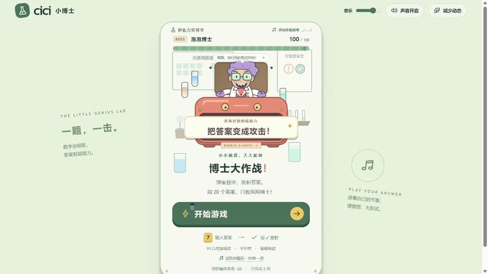
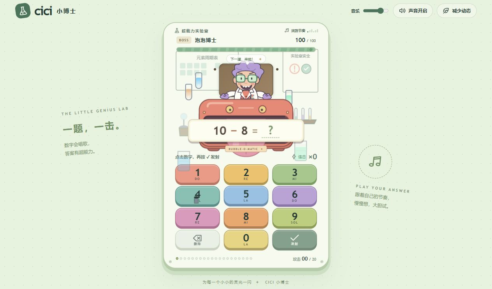
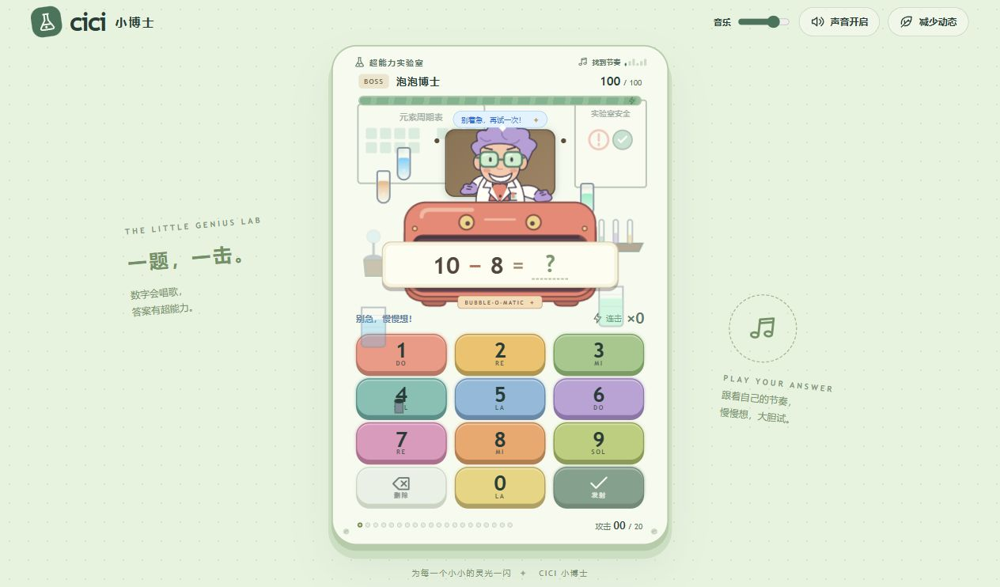
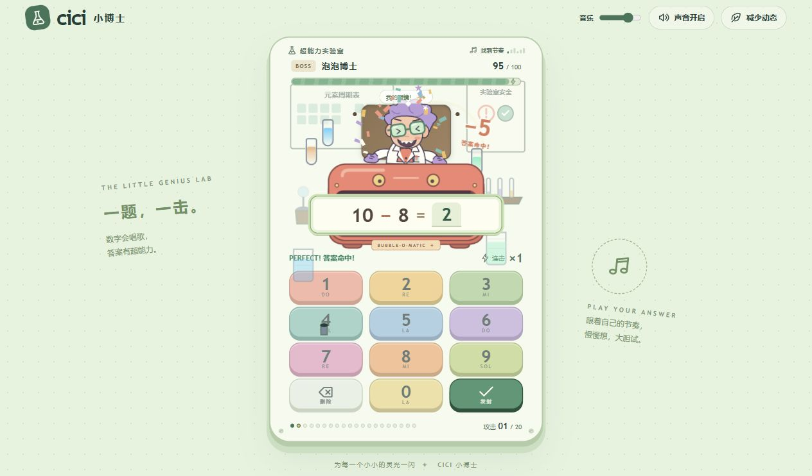
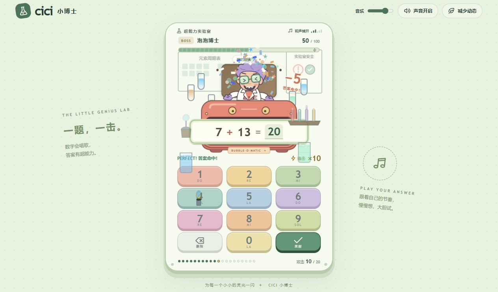
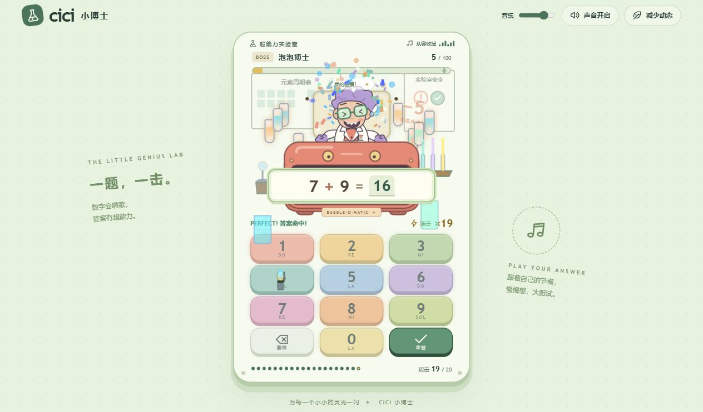
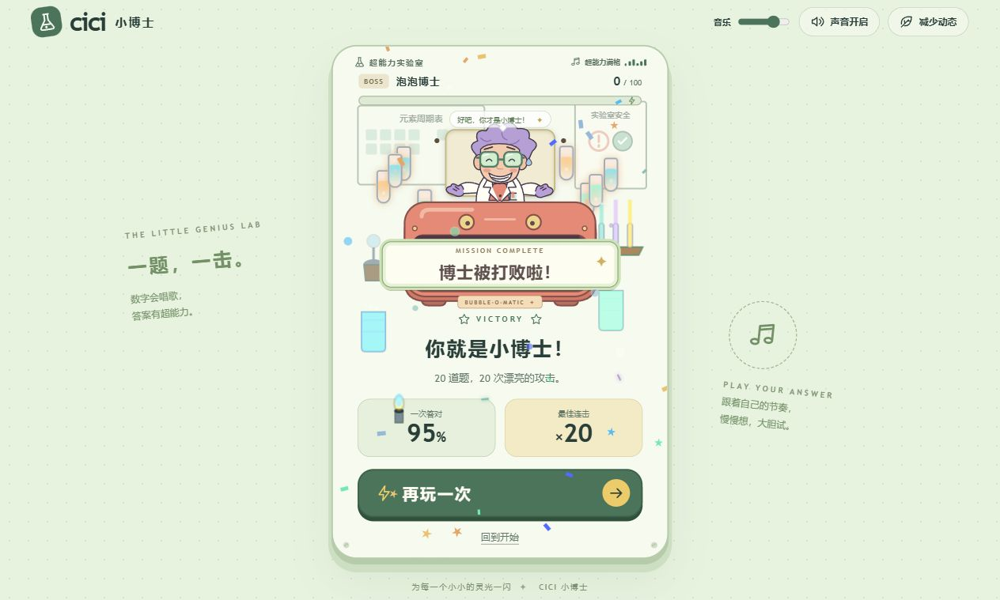
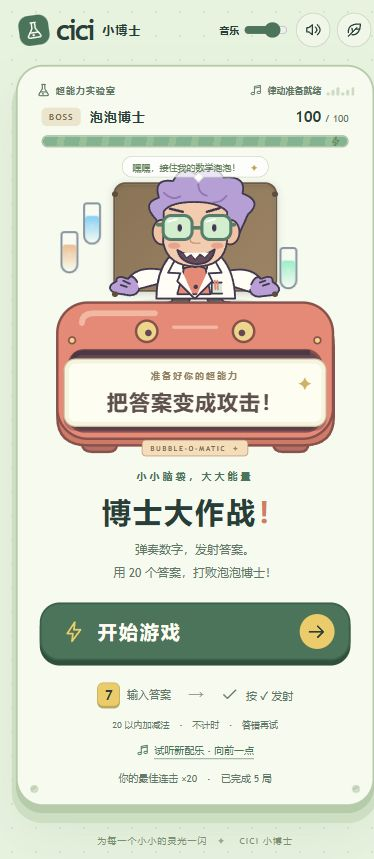
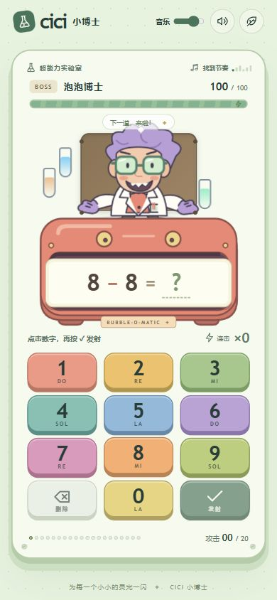

# Cici 小博士：当前版本审查与重构候选

审查日期：2026-10-02。对象是当前工作区，包括用户尚未提交的实验室扩展。当前阶段只做审查、方案与视觉稿；用户选定方向后再重构游戏。

## 结论

核心答题流程能正常完成，新增实验室元素已经显示出来。主要问题是场景被限制在窄小的纵向机柜内，装饰层与操作层重叠；玩法仍然是相同的输入、提交、固定扣血循环。继续增加装饰或粒子数量，不能解决玩家缺少新的操作和阶段目标的问题。

值得保留的基础：合法的口算题目生成、触屏与键盘输入、数字音效、六阶段音乐、答错重试、独立音量、减少动态选项、结算统计。

## 当前流程与截图证据

本次在实际运行的开发版本上操作并截图，未使用旧版截图作为审查证据。桌面窗口为 1280 × 720，手机窗口为 390 × 844。所有保存后的截图均已查看。

1. **开始页面：可用，层次有待改善。** 开始按钮明确；桌面场景宽约 426px，两边空间用于宣传文字，人物和游戏世界显得很小。当前桌面窗口需滚动才能看到完整底部。

   

2. **进入答题：可用，装饰遮挡操作内容。** 题目易识别，数字键可操作。左侧烧杯叠到操作提示和数字 1 附近，本生灯叠到数字 4 上。浅色场景、背景道具与操作区缺少明确的深度分层。

   

3. **答错重试：功能正常，引导不足。** 输入错误答案后清空输入并显示鼓励语，题目保留，可以立即重试。当前只有鼓励语，尚无数轴、拆分或数量演示等具体提示。

   

4. **答案命中：功能正常，表现单一。** 角色歪眼镜、扣 5 HP、显示伤害数字和粒子。输入区、命中区与 Boss 缺少清楚的弹道或能量传递，玩家的动作与结果之间联系偏弱。

   

5. **中段推进：有进度反馈，缺少新玩法。** 完成第 10 题后音乐阶段和粒子增强，Boss 剩 50 HP；仍使用相同题目机器和固定伤害，连击没有可主动触发的奖励。

   

6. **最后阶段：能顺利推进，高潮变化有限。** 第 19 次正确攻击后 Boss 剩 5 HP。试管更多、粒子更密，但场景结构、玩家操作和阶段目标基本相同。

   

7. **胜利结算：功能正常，奖励内容简单。** 一局 20 道题可完整完成；故意答错一次后显示首次答对率 95%、最大连击 20。再玩一次和回到开始均有明确入口，尚无关卡解锁或世界变化的展示。

   

8. **手机开始页面：主要内容完整，场景主题变弱。** 竖屏布局可使用，原有大按钮保留；新增实验器材在这个断点全部隐藏。

   

9. **手机答题：触控空间充足，美术提升没有完整保留。** 本次窗口没有横向溢出，数字按钮约 98 × 51px；人物、题目机器与数字键仍然沿用原有纵向结构。

   

## 代码核对

- `src/styles/lab-theme.css`：实验器材使用机柜百分比定位并处于 `z-index: 1`，没有独立的场景边界；移动端宽度不超过 480px 时将主要器材隐藏。
- `src/game/GameEngine.ts`：正确提交固定推进一题并扣 5 HP。连击只更新计数，没有蓄能、技能、目标选择或场景任务。
- `src/components/Boss.tsx`：`celebrating` 要求正确反馈阶段，但台词判断先命中 `hurt` 分支，导致里程碑庆祝台词无法被选中。
- `src/game/labIntensitySystem.ts`：`lightIntensity`、`chemicalActivity`、`electricEffect` 有计算结果，但没有在当前组件中驱动相应效果。
- `src/animation/particles.ts`：粒子强度按连击推算，实验环境按题目进度推算，两种阶段口径并不一致。
- 现有部分重构说明提到深色背景、电路板和仪表盘；当前源码与实机截图呈现的是浅绿色场景、烧杯、试管和墙面挂图，应以实际运行版本为准。

## 可读性与检查边界

保留现有控件名称、题目播报和较大的触控按钮。下一版应提升次要提示的字号与对比度，确保高亮、特效及装饰不遮挡题目和输入。此次未完成正式对比度测量、屏幕阅读器测试或完整无障碍审计；不能据截图宣称全面符合无障碍标准。

本次 TypeScript 检查通过；现有 6 个测试文件、39 个测试全部通过；所操作页面没有捕获到控制台错误或警告。测试通过说明现有逻辑基础可继续使用，不代表新增美术和交互质量已经达标。

## 三个候选方向

三个方向共同保留：Cici 品牌、儿童口算、数字乐器音效、不强制计时、温和重试、触屏与键盘操作、静音和减少动态选项。视觉稿统一展示一道 `8 + 7 = ?` 的游玩中画面，便于比较。

### 玩具实验室 · 蓄能大作战

- 美术：原创玩具质感角色、圆润实体道具、奶油白与珊瑚橙主色，薄荷和紫色点缀。以有纵深的横向实验室舞台承接角色和弹道，底部是整块操作台。
- 操作：数字输入装填答案，发射后看见泡泡弹飞向目标；连续答对积攒能量，玩家可以主动释放超级泡泡。
- 阶段：20 题分为四个小段，每完成一段产生一次明显的机器变化；阶段奖励与连击奖励分别显示，避免答错后丢失所有进展。
- 重试：答案弹回操作台，提供可选拆分提示，保留温和语气。
- 取舍：与现有小博士主题最连贯，需要重新制作角色、实验台、机器与攻击动画素材。

### 星际节拍 · 轨道突围

- 美术：深靛蓝宇宙、明亮青色和珊瑚色能量，原创卡通飞船与博士机甲；横向战场，底部两排数字乐器键。
- 操作：先点击护盾或核心选择目标，再用答案为发射器充能；连击积攒一轮明显的齐射。音乐节拍增强视觉反馈，正确答案不要求按拍输入。
- 阶段：打破护盾、显露核心、最后突围，Boss 的造型和攻击反馈随阶段改变。
- 重试：飞船保留当前位置，给出可选提示，没有因思考时间长而失去机会的倒计时。
- 取舍：动作表现与画面冲击最强，需要控制光效密度，保证数学题和按键始终清楚。

### 绘本冒险 · 数字森林

- 美术：有纸张与笔触的原创绘本世界，树屋实验台、数字种子与友善森林生物。左侧呈现逐渐复苏的世界，右侧是轻量的答题与种植操作区。
- 操作：点击或拖入数字种子组成答案，再把答案种子送入培养器；答对后立即让树木、桥梁或花朵长出一部分。
- 阶段：四个每段五题的修复节点；段落间选下一处修复目标，让玩家看见自己的选择改变世界。
- 重试：种子回到托盘，可查看数量分组提示。拖动同时提供点击与键盘等价操作。
- 取舍：探索与成长感最强，需制作世界修复各阶段的素材，战斗爆发感相对柔和。

## 选定后的重构边界

选定截图后，以该图作为视觉目标，重构场景、角色、操作区、阶段状态和动作反馈；保留已经验证的数学与音频基础。先实现一个完整的 20 题闭环，再验证桌面、手机、错误重试、阶段切换、技能或成长操作、胜利和重开。当前不修改游戏运行源码，不提交或覆盖用户的现有改动。

生成图属于成品级视觉设计稿，并非已重构版本的实机截图。方案编号以聊天中三张生成图的实际显示顺序为准。

## 本轮视觉稿与选择编号

三张独立图已在聊天中依次显示，以下映射依据实际显示顺序确定。原始生成文件保留，项目内副本用于下一轮重构时作为视觉依据。

| 聊天中的编号 | 方向 | 视觉目标 |
|---|---|---|
| 1 | 玩具实验室 · 蓄能大作战 | [完整效果图](./concept-01-toy-lab.png) |
| 2 | 星际节拍 · 轨道突围 | [完整效果图](./concept-02-space-rhythm.png) |
| 3 | 绘本冒险 · 数字森林 | [完整效果图](./concept-03-storybook-forest.png) |

状态：等待用户选择。收到清楚的编号选择后直接开始相应重构；若用户提出融合或修改，先生成确认修改内容的视觉稿。
