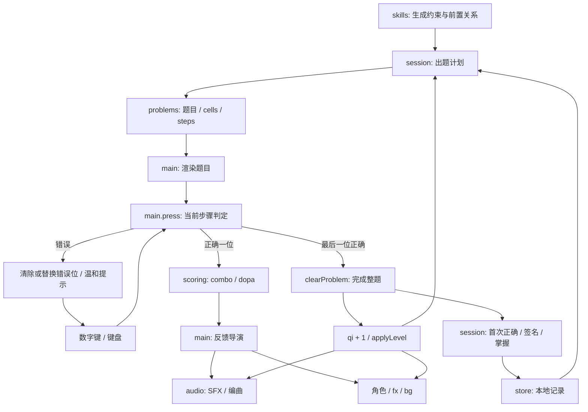

# dopa-drill 逆向分析

完成于 2026-10-01。此阶段只阅读参考项目、分析机制，没有编写 Cici 游戏代码。

参考仓库：https://github.com/grmchn/dopa-drill 。通过 `gh repo clone -- --depth=1` 克隆至工作区之外的临时目录，分析提交为 `fdacd5fc8322f251f92ddc07f13ae85ccb2263dd`。以下行号均对应该提交；结论基于源码与公开规格，体验解释属于设计推断。

## 1. Gameplay Loop 与模块职责

它是一款无失败终局的计算练习游戏。用户输入数字，数字被角色搬到题目里，每一位正确答案都产生声画奖励；题目完成后，导演层推进题目，并提高整个舞台的表现强度。

特别注意：参考项目不是“输入完整答案后按确认”。`main.js:426` 的 `press()` 按 `problem.steps[step].digit` 逐位即时判定；正确位保留，错误位可替换。最后一位正确后才完成题目。Cici 会重新实现完整答案 + 确认攻击的交互。

| 模块 | 主要职责 | 与循环的关系 |
| --- | --- | --- |
| `problems.js` | 随机数、受约束题目生成、格子布局、输入步骤、题目签名 | 产生题目及正确输入序列 |
| `skills.js` | 58 个技能、年级、前置关系、生成参数、掌握阈值 | 定义题目范围和难度 |
| `session.js` | 出题计划、初始能力评估、掌握、复习、星级、近期签名 | 决定下一题来自什么技能，记录学习结果 |
| `main.js` | 全局 `S`、画面、输入、计时、判定协调、反馈导演 | 连接业务规则、DOM、音频、角色和特效 |
| `scoring.js` | 纯函数得分、对数奖励值、combo 倍率与时间窗 | 把正确输入映射成奖励 |
| `audio.js` | 实时／离线合成、乐器、混音、编曲、sequencer、SFX | 输入、答题、进度、结局的音乐反馈 |
| `dopakichi.js` | SVG 角色和演技 | 搬运数字、庆祝、恢复动作；品牌资产不复用 |
| `fx.js` | Canvas 2D 粒子、光环、浮字、烟花 | 局部和全屏奖励 |
| `bg.js` | WebGL 背景及 CSS 回退 | 随强度和音乐拍点升级舞台 |
| `core.js` | 时钟、帧更新、插值、缓动、弹簧 | 支撑动画和导演时间线 |
| `store.js` | localStorage、缓存、历史、设置和其他本地记录 | 容错读取和保存 |

数据流：



输入判定不等待角色搬运完成，中间正确位会立即激活下一位。最终正确位会锁住当前题目，完成反馈后换题；`run` 与画面检查用于阻止旧异步回调污染新的一局。

## 2. Audio Architecture

`audio.js` 共 774 行。它把图构建、合成器、乐谱、调度、SFX、离线 WAV 导出放在同一文件。没有依赖 MP3。

### 实际音频图

`makeGraph()` 位于 `audio.js:9`。实际图比简单的 Music Bus / SFX Bus 多了独立鼓路和共享效果发送：

```text
Oscillators / Noise Buffer
  ├─ kick / clap / snare / hat / shaker / crash / impact
  │    → Drums Gain (0.9) ───────────────────────────────┐
  ├─ bass / pad / pluck / arp / stab / lead / choir      │
  │    → Music Gain (0.8) → Lowpass → Duck Gain ─────────┤
  └─ blip / bell / pop / boing / whistle / coin / riser  │
       → SFX Gain (0.85) ───────────────────────────────┤
                                                        │
Voice envelope → send → Reverb Gain → Highpass           │
                                      → Convolver ─────┤
Voice envelope → send → Delay → Lowpass ────────────────┤
                         ↑          └─ Feedback Gain ─┘│
                                                        ↓
                                            Master Gain (0.72)
                                                        ↓
                               Dynamics Compressor (-16dB, 3.2:1)
                                                        ↓
                         第二个 Compressor 作 limiter (-2.5dB, 20:1)
                                                        ↓
                                           AudioContext.destination
```

注意：图中的 delay feedback 回到 DelayNode，不回到 Master；共享效果返回直接进入 Master，所以 music duck 不会衰减全部鼓声、SFX 或效果尾音。参考图不是一个统一的 Music Bus。这里的 limiter 也是压缩器近似限制器，不是严格的 true-peak brickwall limiter。

### 节点与声音的关系

| Web Audio 节点 | 在参考实现中的用途 | Cici 可继承的思想 |
| --- | --- | --- |
| `AudioContext` | 首次用户操作 `unlock()` 后创建；`latencyHint: interactive`；恢复 suspended 状态 | 用户手势内解锁，异常可降级为静音游戏 |
| `GainNode` | 乐器包络、音量、总线、发送、duck、反馈 | 把“声音形状”和“混音音量”分开；音量变化平滑 |
| `OscillatorNode` | sine／triangle／square／sawtooth；叠振、detune、LFO 和 FM | 用短包络生成玩具感音色，避免音频素材下载 |
| `BiquadFilterNode` | 限制噪声频段、柔化 bass／lead、音色扫频、music 低通 | 控制刺耳频段，错误音保留柔和低频 |
| `DynamicsCompressorNode` | Master 压缩与第二级限制 | 多层叠加预留余量，抑制峰值 |
| `DelayNode` | 附点八分音符回声，随 BPM 重新定时 | 效果尾音与节拍关联；MVP 可先不实现 |
| `ConvolverNode` | 用程序生成双声道衰减噪声脉冲，2.4 秒混响 | 无素材也能产生空间感；MVP 可省略以控制成本 |
| `StereoPannerNode` | hat、arp、bell、swoosh 的定位与运动；缺失时 Gain 回退 | 轻微声像拓宽音场，重要提示单声道也清楚 |
| `AudioBufferSourceNode` | 复用 2 秒 noise buffer 生成鼓／扫频声 | 噪声缓冲一次生成，多次使用 |

合成例子：kick 是 sine 的频率快速下滑 + 短噪声瞬态；snare 是带通噪声 + triangle；hat 是高通噪声；bass 是双振荡器 + 动态低通；pad 用微失谐锯齿叠振 + 慢包络；pluck 是短 sine 与高次分音；bell 使用频率调制；riser、swoosh 用扫频噪声和包络形成方向感。

指数包络使用很小的正值而非 0，避免 exponentialRamp 的非法目标。振荡器和噪声源有明确 stop 时间。Cici 还需在 onended 中显式断开节点并限制瞬时声部数量。

### Sequencer 与 BPM

`AudioEngine.update()` 在 `main.js` 的帧循环中被调用。每次向前预排 120ms，用 `AudioContext.currentTime` 调度，而不是用 JS 定时器直接按时播放音符。一步为十六分音符：`stepDur = 60 / bpm / 4`，每小节 16 步，四小节和声循环。

发生长卡顿时，`nextTime` 落后超过 250ms 就移到当前时间之后，避免一次性补发所有过期音符。记录的 `beats` 与 `kicks` 给视觉层提供 phase／kick pulse，不让 React／DOM 计时反向控制音频时钟。

`setLevel()` 设置 BPM 并调整 delay。原实现 BPM 随每题级别离散更新，没有独立持续渐变的 tempo smoothing；这是 Cici 应改进的点。

经典曲一直有较轻的 pluck、shaker、pad 底层，再随 L 加入 kick、bass、clap、hat、arp、stab、lead、choir。还有四套可解锁编曲。Cici 只需一套原创乐谱，不能拷贝 `PROG`、`HOOK` 或解锁歌曲。

### SFX、ducking 与总线

`keyTap()` 依据当前和声及 combo 选音；`correct()`、`clear()` 随强度叠加 bell、coin、crash、impact；`wrong()` 用弹簧式 boing 和短 duck，音乐持续。`setReach()` 使用低通、riser、snare roll 营造高潮，`finale()` 用和弦、冲击、铃音解放张力。

duck 是 Gain 自动化，不是暂停音乐。高层节拍 kick 也驱动 duck，产生呼吸感。Cici 继承分总线、包络与节拍时钟思想；输入音固定映射 C 大调五声音阶，易学且与原创 C／F／Am 编曲兼容。正确反馈只短暂降低 Music Bus，突出攻击 SFX；错误时音乐保持不变。

统一 `play(name, time, params)` 还能捕获事件并用 OfflineAudioContext 离线重建。Cici 不做录制产品功能，但可用 OfflineAudioContext 验证声音非静默、峰值和结束包络。

## 3. Progressive Feedback System

为什么像游戏：每次正确输入都有短反馈，每题完成有更大的反馈，一整局又形成逐渐上升的曲线。三个时间尺度共同提供“我的操作让世界发生变化”的因果关系。

参考项目的强度公式在 `main.js:237`：

```text
E = 0.08 + 0.92 × (i / (N - 1))^1.3
L = min(10, round(E × 10))
BPM = 112 + 16 × min(1, E)
```

第一题并非恰好 112 BPM，而是 113.28；最后一题是 128，另转调 2 半音。视觉随 E 增加粒子、角色动作、背景饱和度、观众和终局演出；最后阶段还增加乐器密度、音效叠层和奖励符号。错误不会降低 E、得分或 dopa，只中断 combo。这让重试仍处在向前的舞台氛围里。

抽象为独立系统：

```text
权威练习进度 p ──→ 强度曲线 e(p)
                       ├─→ BPM target → 平滑插值 → 音频时钟
                       ├─→ layer thresholds → 编曲声部
                       ├─→ 场景变化 → 灯光 / 表情 / 标识
                       └─→ reward budget → 粒子 / 声音 accent
连续正确 combo ────────→ 局部奖励增益（有上限）
Reduced Motion ────────→ 动效预算（不修改数学规则）
```

值得继承：单一进度输入、渐进编曲、短／中／长反馈层级、音乐不断流、奖励与练习正确性分离。不要继承：特定角色／纹样、原曲、全屏不断变色、越来越长的换题等待。Cici 使用固定 20 次有效攻击；combo 只改变表现，不能跳题或提前打败 Boss。节奏感不等于必须按拍答题，低年级孩子有完整思考时间。

## 4. Math Engine 与 Session

`skills.js` 用数据指定 generator 及参数，前置关系决定解锁；`DEPTH` 提供难度排序，通常掌握条件是最近 6 题中 5 题首次正确。

`problems.js` 将数学与格子布局放在一起。输出既含 `a/b/answer`，也有 `rows/cols/cells/lines/steps`。笔算会生成进借位、部分积、长除法步骤，答案是标准表示的字符串；分数不接受任意等价写法。

非法题目控制：

- 加法按 carry 参数筛选进位，并限制答案位数。
- 减法 generator 要求 `y < x`，筛选借位；原项目普通减法答案不含 0，Cici 则允许相等数相减得到 0。
- 除法从商、除数构造整除题或余数，避免除以 0；小数用整数缩放降低浮点误差。
- 各 generator 有 200～800 次重试上限，失败会 throw；MVP 有限题域适合直接枚举合法候选，避免生成失败。
- `signature = title + text`；`makeProblem()` 最多重试 40 次排除近期签名，候选不足时仍可能重复。`main.sessionProblem()` 合并技能近期 24 签名与本局集合。

`session.js` 提供年级计划、技能练习、自适应评估、约 30% 已掌握技能复习；评估能调整跳跃步长，完成结果可更新掌握、星级、时间记录、复习与时间胶囊。它是纯逻辑操作普通对象，保存由 `store.js` 负责，但仍包含技能树布局，职责偏多。

计数区别：`solved` 是最终完成题数；`misses` 是错误数字输入次数；`firstTry` 是整题从未输错的完成数。基本准确率采用首次正确题数 / 基本题数；所有题答对后完成分固定 100。`scoring.js` 中 combo 和 dopa 属于奖励表现，combo 不修改题目得分；dopa 在 log10 空间增长，有独立上限。

Cici 只继承：可测试生成器、明确范围、连续去重、整题错误／正确记录、session 权威进度。只实现整数加减，操作数和答案均 0～20；一局保证加法 10 题、减法 10 题，题序混合，前 4 题热身。准确率明确定义为“一次答对的题数 / 20”，避免最终均答对后每局记录总是 100%。

## 5. Architecture Problems 与重新拆分

1. `main.js` 2599 行，是状态、DOM 渲染、音频、进度、动画、统计、课程、日历、引导、对话框和事件注册的中心。`S` 没有类型和显式状态机，很多功能共享布尔标志；组合状态容易不可达或相互冲突。
2. 大量 document 查询、innerHTML、classList 和 tween 直接操作界面。不能原封不动迁进 React，否则双重 DOM 所有权和异步动画回调可能覆盖组件的最新状态。
3. 角色搬运回调触发 `onCorrect`，其中又完成题目、记录和启动下一题；业务时序与表演时序耦合。Cici 判定立即提交权威状态，独立控制器协调有限反馈时间，动画不能决定是否正确。
4. `problems.js` 658 行混合数学、教学提示、题型和布局。Cici `Question` 保持四个字段，UI 自己渲染算式。
5. `session.js` 混合学习计划与技能树排布；本 MVP 不需要课程、解锁、星级、评估与 retention 系统。
6. `audio.js` 774 行混合图、乐器、节拍、曲目、SFX 和 WAV 导出。拆成 AudioEngine／Mixer／Synth／Sequencer／MusicEngine／SFX，音频对象独立于 Zustand。
7. 音频 scheduler 由 rAF 驱动，后台节流会影响预排；Cici 使用短周期 look-ahead，切后台显式暂停调度和音频上下文，恢复不补发过期音符。
8. `store.js` 是可变全局缓存，允许从 JSON 合并额外未知字段，验证偏宽；Cici 只白名单验证三个统计量，storage 异常不会让游戏中断。
9. `fx.js` 直接依赖品牌角色 sprite，`bg.js` shader 含品牌头部轮廓。都不复用；Cici 只写有上限、按需运行的普通星星／纸屑粒子，背景用 CSS。
10. 帧循环每帧读取布局、多次写 DOM、更新多层全屏视觉；Reduced Motion 仍留有部分背景／角色动作。Cici UI 使用 Zustand 字段选择器，音频拍点只更新局部 CSS 变量，不每帧 setState；减少动态效果时完全停掉粒子、晃动和持续动画。

这些是当前结构在迁移与维护上的风险，不是声称参考项目必定有性能故障。它已有重试上限、run 防陈旧回调、存储容错、WebGL 回退和纯逻辑测试，值得保留这些工程思想。

## 6. License Boundary 与 Clean-room 边界

仓库 [LICENSE](https://github.com/grmchn/dopa-drill/blob/fdacd5fc8322f251f92ddc07f13ae85ccb2263dd/LICENSE) 明确：软件为 MIT，但 Dopakichi、Dopa Drill 名称／Logo 及造型不在 MIT 范围内。非商业同人许可也不允许将角色作为另一个产品品牌。字体另有 SIL OFL 许可。

本项目只研究软件架构、游戏反馈、Web Audio 合成与调度、进度系统和数学引擎思想，不拷贝源码、旋律序列、角色、SVG、图标、Logo、字体文件或视觉素材。参考克隆不会进入 Cici 源码或发布产物。Cici 名称、泡泡博士造型、吐题机器、色彩和曲目均重新创作。

这是“分析后依据独立规格重新编写”的 clean-room reimplementation 工作流；由于同一开发者阅读了参考源码，不声称这是法律意义上完全隔离团队的 clean room。如将来引入 MIT 源码片段，需要保留原版权与许可，但当前计划不引入。

Phase 1 完成：理解机制并记录取舍。下一步先写四层架构文档，再建立独立 Vite 项目。
